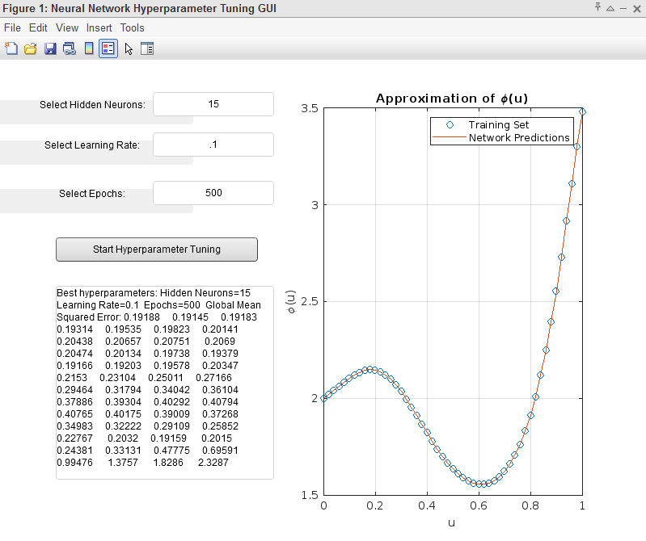

# Project Summary
## Purpose of the Document

The purpose of this document is to outline the steps required to address the design problem of a two-layer neural network approximating the function φ: R→R, 
where φ(u) = 1 + e^(-usin(2πu-2)).
## Scope of the System

The document is divided into three chapters:

    General Description of the Product: Provides an overview of the software product, including the project's initial situation, objectives, context, and benefits.
    Functional Requirements: Lists the functional requirements that the software product should meet, including actors, system boundary, and use cases.
    Non-functional Requirements: Expounds on the non-functional requirements of the application, such as performance, security, and availability.

## General Description of the Product
### The Current Situation
The project aims to develop a two-layer artificial neural network (ANN) with a hidden layer utilizing the tangent sigmoid activation function and an output layer using a linear activation function. The goal is to approximate a given mathematical function φ(u).

### Purpose of the Product
Traditional methods may struggle to capture the intricate and nonlinear patterns of this function, necessitating the development of a specialized solution. The product aims to provide a computational tool capable of learning and approximating the complex relationship described by the specified mathematical function.

### Product Context
The product focuses on creating a neural network architecture tailored specifically for approximating mathematical functions. It is designed as a standalone solution, emphasizing its adaptability to various datasets and its ability to handle nonlinear mathematical functions.

### Benefits
The solution offers precise and efficient approximation of complex mathematical functions. By harnessing the power of neural networks and an adapted architecture, it can capture intricate patterns that may be difficult to obtain with traditional methods. The flexibility of the neural network allows adaptation to diverse datasets and mathematical functions, enhancing its utility across different domains.
## Functional Requirements
### Actors
The main actor interacting with the system is the User, who performs various operations such as training the neural network, running predictions, adjusting network configuration, and managing errors.

### System Boundary
The system boundary encompasses the functionalities and interactions of the artificial neural network within the Matlab environment.

### Use Cases Description
Use cases describe different scenarios in which the artificial neural network system is used, detailing interactions between the system and its users.

## Non-functional Requirements
The non-functional requirements include user interface requirements, performance requirements, availability & reliability, and security requirements.

## Conclusion
This project focuses on developing an artificial neural network system capable of approximating complex mathematical functions. By leveraging specialized architectures and algorithms, the system aims to provide accurate predictions and efficient performance, addressing the limitations of traditional methods.

